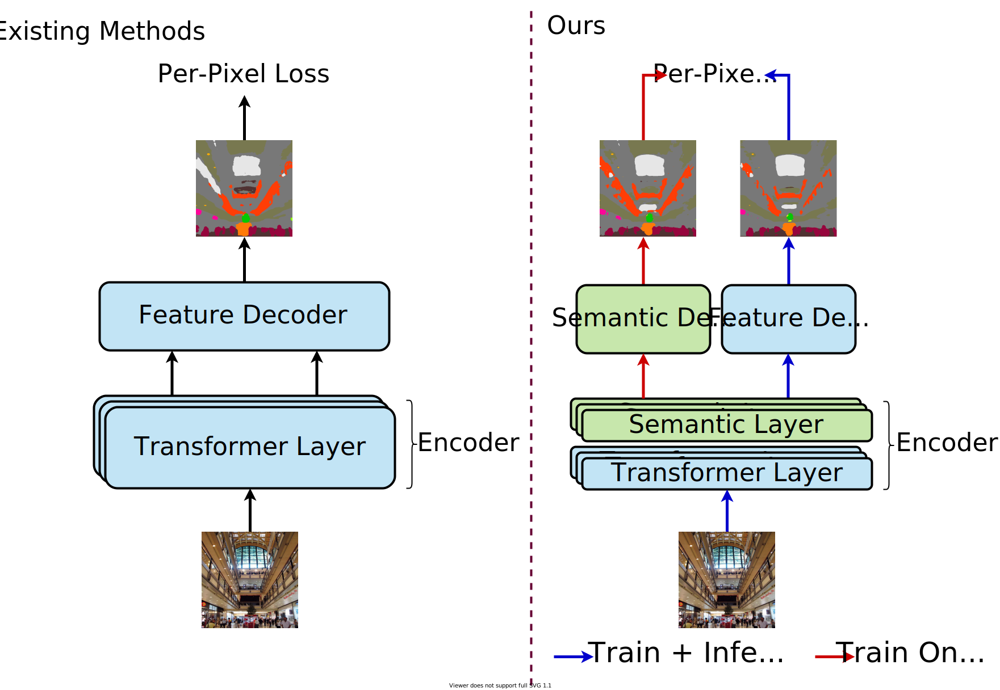

# SeMask: Semantically Masked Transformers

[](https://pytorch.org/)

[Jitesh Jain](https://praeclarumjj3.github.io/), [Anukriti Singh](https://anukritisinghh.github.io/), [Nikita Orlov](https://www.linkedin.com/in/nukich74/), [Zilong Huang](https://speedinghzl.github.io/), [Jiachen Li](https://chrisjuniorli.github.io/), [Steven Walton](https://stevenwalton.github.io/about/), [Humphrey Shi](https://www.humphreyshi.com/home)

This repo contains the code for our paper **SeMask: Semantically Masked Transformers for Semantic Segmentation**.



## Contents
1. [Results](#1-results)
2. [Setup Instructions](#2-setup-instructions)
3. [Citing SeMask](#4-citing-semask)

## 1. Results

`Note:` &dagger; denotes the backbones were pretrained on ImageNet-22k and 384x384 resolution images.

### ADE20K

| Method | Backbone | Crop Size | mIoU | mIoU (ms+flip) | #params | config |
|   :---:| :---:    | :---:     | :---:| :---:          | :---:   | :---:  |
| SeMask-T FPN | SeMask Swin-T | 512x512 | 42.11  | 43.16 | 35M | [config](SeMask-FPN/configs/semask_swin/ade20k/semfpn_semask_swin_tiny_patch4_window7_512x512_80k_ade20k.py) |
| SeMask-S FPN | SeMask Swin-S | 512x512 | 45.92  | 47.63 | 56M | [config](SeMask-FPN/configs/semask_swin/ade20k/semfpn_semask_swin_small_patch4_window7_512x512_80k_ade20k.py) |
| SeMask-B FPN | SeMask Swin-B<sup>&dagger;</sup> | 512x512 | 49.35  | 50.98 | 96M | [config](SeMask-FPN/configs/semask_swin/ade20k/semfpn_semask_swin_base_patch4_window12_512x512_80k_ade20k.py) |
| SeMask-L FPN | SeMask Swin-L<sup>&dagger;</sup> | 640x640 | 51.89  | 53.52 | 211M| [config](SeMask-FPN/configs/semask_swin/ade20k/semfpn_semask_swin_large_patch4_window12_640x640_80k_ade20k.py) |
| SeMask-L MaskFormer | SeMask Swin-L<sup>&dagger;</sup> | 640x640 | 54.75  | 56.15 | 219M | [config](SeMask-MaskFormer/configs/ade20k-150/semask_swin/maskformer_semask_swin_large_IN21k_384_bs16_160k_res640.yaml) |
| SeMask-L Mask2Former | SeMask Swin-L<sup>&dagger;</sup> | 640x640 | 56.41  | 57.52 | 222M | [config](SeMask-Mask2Former/configs/ade20k/semantic-segmentation/semask_swin/maskformer2_semask_swin_large_IN21k_384_bs16_160k_res640.yaml) |
| SeMask-L Mask2Former FAPN | SeMask Swin-L<sup>&dagger;</sup> | 640x640 | **56.68**  | 58.00 | 227M | [config](SeMask-FAPN/SeMask-Mask2Former/configs/ade20k/semantic-segmentation/semask_swin/fapn_maskformer2_semask_swin_large_IN21k_384_bs16_160k_res640.yaml) |
| SeMask-L Mask2Former MSFAPN | SeMask Swin-L<sup>&dagger;</sup> | 640x640 | 56.54  | **58.22** | 224M | [config](SeMask-FAPN/SeMask-Mask2Former/configs/ade20k/semantic-segmentation/semask_swin/msfapn_maskformer2_semask_swin_large_IN21k_384_bs16_160k_res640.yaml) |

### Cityscapes

| Method | Backbone | Crop Size | mIoU | mIoU (ms+flip) | #params | config |
|   :---:| :---:    | :---:     | :---:| :---:          | :---:   | :---:  |
| SeMask-T FPN | SeMask Swin-T | 768x768 | 74.92  | 76.56 | 34M | [config](SeMask-FPN/configs/semask_swin/cityscapes/semfpn_semask_swin_tiny_patch4_window7_768x768_80k_cityscapes.py) |
| SeMask-S FPN | SeMask Swin-S | 768x768 | 77.13  | 79.14 | 56M | [config](SeMask-FPN/configs/semask_swin/cityscapes/semfpn_semask_swin_small_patch4_window7_768x768_80k_cityscapes.py) |
| SeMask-B FPN | SeMask Swin-B<sup>&dagger;</sup> | 768x768 | 77.70  | 79.73 | 96M | [config](SeMask-FPN/configs/semask_swin/cityscapes/semfpn_semask_swin_base_patch4_window12_768x768_80k_cityscapes.py) |
| SeMask-L FPN | SeMask Swin-L<sup>&dagger;</sup> | 768x768 | 78.53  | 80.39 | 211M| [config](SeMask-FPN/configs/semask_swin/cityscapes/semfpn_semask_swin_large_patch4_window12_768x768_80k_cityscapes.py) |
| SeMask-L Mask2Former | SeMask Swin-L<sup>&dagger;</sup> | 512x1024 | **83.97**  | **84.98** | 222M | [config](SeMask-Mask2Former/configs/cityscapes/semantic-segmentation/semask_swin/maskformer2_semask_swin_large_IN21k_384_bs16_90k.yaml) |

### COCO-Stuff 10k

| Method | Backbone | Crop Size | mIoU | mIoU (ms+flip) | #params | config |
|   :---:| :---:    | :---:     | :---:| :---:          | :---:   | :---:  |
| SeMask-T FPN | SeMask Swin-T | 512x512 | 37.53  | 38.88 | 35M | [config](configs/semask_swin/coco_stuff10k/semfpn_semask_swin_tiny_patch4_window7_512x512_80k_coco10k.py) |
| SeMask-S FPN | SeMask Swin-S | 512x512 | 40.72  | 42.27 | 56M | [config](configs/semask_swin/coco_stuff10k/semfpn_semask_swin_small_patch4_window7_512x512_80k_coco10k.py) |
| SeMask-B FPN | SeMask Swin-B<sup>&dagger;</sup> | 512x512 | 44.63  | 46.30 | 96M | [config](configs/semask_swin/coco_stuff10k/semfpn_semask_swin_base_patch4_window12_512x512_80k_coco10k.py) |
| SeMask-L FPN | SeMask Swin-L<sup>&dagger;</sup> | 640x640 | 47.47  | 48.54 | 211M| [config](configs/semask_swin/coco_stuff10k/semfpn_semask_swin_large_patch4_window12_640x640_80k_coco10k.py) |

## 2. Setup Instructions

We provide the codebase with SeMask incorporated into various models. Please check the setup instructions inside the corresponding folders:

- SeMask-FPN: [Setup Instructions](SeMask-FPN/README.md#2-setup-instructions)
- SeMask-MaskFormer: [Setup Instructions](SeMask-MaskFormer/README.md#2-setup-instructions)
- SeMask-Mask2Former: [Setup Instructions](SeMask-Mask2Former/README.md#2-setup-instructions)
- SeMask-FAPN: [Setup Instructions](SeMask-FAPN/README.md#2-setup-instructions)

## 3. Citing SeMask

```BibTeX
@article{jain2022semask,
  title={SeMask: Semantically Masking Transformer Backbones for Effective Semantic Segmentation},
  author={Jitesh Jain and Anukriti Singh and Nikita Orlov and Zilong Huang and Jiachen Li and Steven Walton and Humphrey Shi},
  journal={arXiv preprint arXiv:...},
  year={2022}
}
```

## Acknowledgements

Code is based heavily on the following repositories: [Swin-Transformer-Semantic-Segmentation](https://github.com/SwinTransformer/Swin-Transformer-Semantic-Segmentation), [Mask2Former](https://github.com/facebookresearch/Mask2Former), [MaskFormer](https://github.com/facebookresearch/MaskFormer) and [FaPN-full](https://github.com/ShihuaHuang95/FaPN-full).
