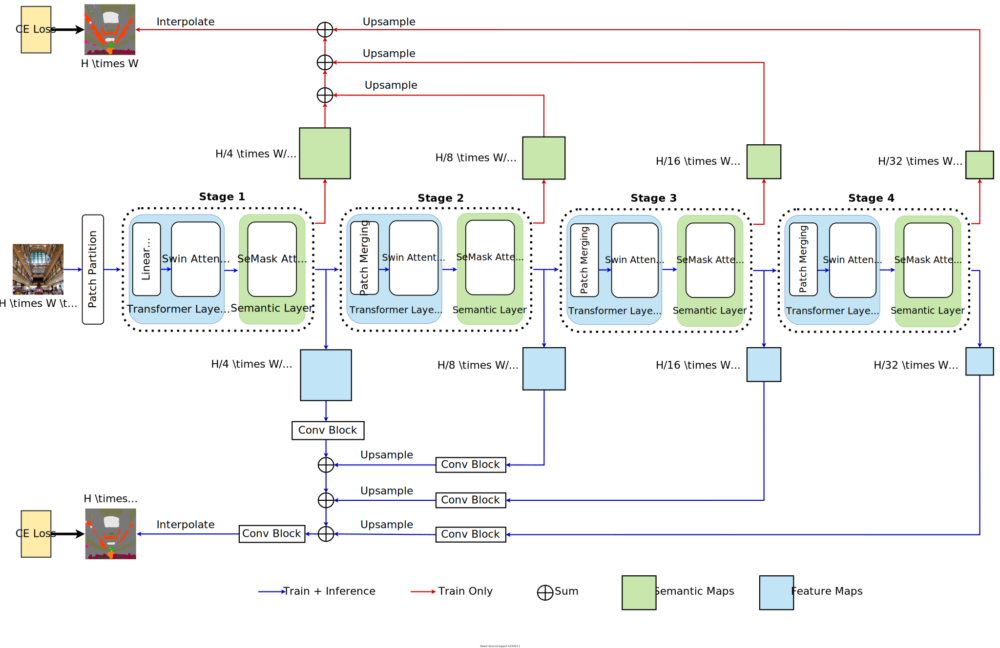
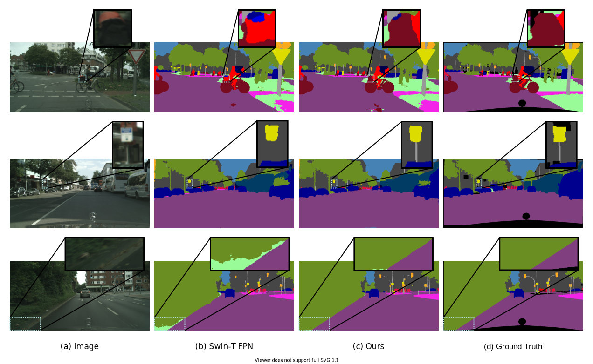

# SeMask FPN


This repo contains the code for our paper **SeMask: Semantically Masked Transformers for Semantic Segmentation**. It is based on [mmsegmentaion](https://github.com/open-mmlab/mmsegmentation/tree/v0.11.0).



## Contents
1. [Results](#1-results)
2. [Setup Instructions](#2-setup-instructions)
3. [Demo](3-demo)
4. [Citing SeMask](#4-citing-semask)

## 1. Results

- &dagger; denotes the backbones were pretrained on ImageNet-22k and 384x384 resolution images.
- Pre-trained models can be downloaded from [Swin Transformer for ImageNet Classification](https://github.com/microsoft/Swin-Transformer).
- Access code for `baidu` is `swin`.

### ADE20K

<!-- | SeMask-T FPN | SeMask Swin-T | 512x512 | 42.06  | 43.36 | 35M | [config](configs/semask_swin/ade20k/semfpn_semask_swin_tiny_patch4_window7_512x512_80k_ade20k.py) | [checkpoint](https://drive.google.com/file/d/1L0daUHWQGNGCXHF-cKWEauPSyBV0GLOR/view?usp=sharing) | -->

| Method | Backbone | Crop Size | mIoU | mIoU (ms+flip) | #params | config | Checkpoint |
|   :---:| :---:    | :---:     | :---:| :---:          | :---:   | :---:  |    :---:   |
| SeMask-T FPN | SeMask Swin-T | 512x512 | 42.11  | 43.16 | 35M | [config](configs/semask_swin/ade20k/semfpn_semask_swin_tiny_patch4_window7_512x512_80k_ade20k.py) | TBD |
| SeMask-S FPN | SeMask Swin-S | 512x512 | 45.92  | 47.63 | 56M | [config](configs/semask_swin/ade20k/semfpn_semask_swin_small_patch4_window7_512x512_80k_ade20k.py) | [checkpoint](https://drive.google.com/file/d/1QhDG4SyGFtWL5kP9BbBoyPqTuFu7fH_y/view?usp=sharing) |
| SeMask-B FPN | SeMask Swin-B<sup>&dagger;</sup> | 512x512 | 49.35  | 50.98 | 96M | [config](configs/semask_swin/ade20k/semfpn_semask_swin_base_patch4_window12_512x512_80k_ade20k.py) | [checkpoint](https://drive.google.com/file/d/1PXCEhrrUy5TJC4dUp7YDQvaapnMzGT6C/view?usp=sharing) |
| SeMask-L FPN | SeMask Swin-L<sup>&dagger;</sup> | 640x640 | 51.89  | 53.52 | 211M| [config](configs/semask_swin/ade20k/semfpn_semask_swin_large_patch4_window12_640x640_80k_ade20k.py) | [checkpoint](https://drive.google.com/file/d/1u5flfAQCiQJbMZbZPIlGUGTYBz9Ca7rE/view?usp=sharing) |


### Cityscapes

| Method | Backbone | Crop Size | mIoU | mIoU (ms+flip) | #params | config | Checkpoint |
|   :---:| :---:    | :---:     | :---:| :---:          | :---:   | :---:  |    :---:   |
| SeMask-T FPN | SeMask Swin-T | 768x768 | 74.92  | 76.56 | 34M | [config](configs/semask_swin/cityscapes/semfpn_semask_swin_tiny_patch4_window7_768x768_80k_cityscapes.py) | [checkpoint](https://drive.google.com/file/d/1_JBOJQSUVes-CWs075XyPnuNfG5psELr/view?usp=sharing) |
| SeMask-S FPN | SeMask Swin-S | 768x768 | 77.13  | 79.14 | 56M | [config](configs/semask_swin/cityscapes/semfpn_semask_swin_small_patch4_window7_768x768_80k_cityscapes.py) | [checkpoint](https://drive.google.com/file/d/1WyT207dZmdwETBUR6aeiqOVfQdUIV_fN/view?usp=sharing) |
| SeMask-B FPN | SeMask Swin-B<sup>&dagger;</sup> | 768x768 | 77.70  | 79.73 | 96M | [config](configs/semask_swin/cityscapes/semfpn_semask_swin_base_patch4_window12_768x768_80k_cityscapes.py) | [checkpoint](https://drive.google.com/file/d/1-LzVB6XzD7IR0zzE5qmE0EM4ZTv429b4/view?usp=sharing) |
| SeMask-L FPN | SeMask Swin-L<sup>&dagger;</sup> | 768x768 | 78.53  | 80.39 | 211M| [config](configs/semask_swin/cityscapes/semfpn_semask_swin_large_patch4_window12_768x768_80k_cityscapes.py) | [checkpoint](https://drive.google.com/file/d/1R9DDCmucQ_a_6ZkMGufEZCzJ-_qVMqCB/view?usp=sharing) |

### COCO-Stuff 10k

| Method | Backbone | Crop Size | mIoU | mIoU (ms+flip) | #params | config | Checkpoint |
|   :---:| :---:    | :---:     | :---:| :---:          | :---:   | :---:  |    :---:   |
| SeMask-T FPN | SeMask Swin-T | 512x512 | 37.53  | 38.88 | 35M | [config](configs/semask_swin/coco_stuff10k/semfpn_semask_swin_tiny_patch4_window7_512x512_80k_coco10k.py) | [checkpoint](https://drive.google.com/file/d/1qhXsJ8H64JPI_DW7CNzhxpHSEG2sKaIl/view?usp=sharing) |
| SeMask-S FPN | SeMask Swin-S | 512x512 | 40.72  | 42.27 | 56M | [config](configs/semask_swin/coco_stuff10k/semfpn_semask_swin_small_patch4_window7_512x512_80k_coco10k.py) | [checkpoint](https://drive.google.com/file/d/1ddXSMQu5ClkbLNMyQdyT0ATaOr86vIkL/view?usp=sharing) |
| SeMask-B FPN | SeMask Swin-B<sup>&dagger;</sup> | 512x512 | 44.63  | 46.30 | 96M | [config](configs/semask_swin/coco_stuff10k/semfpn_semask_swin_base_patch4_window12_512x512_80k_coco10k.py) | [checkpoint](https://drive.google.com/file/d/1pGWI7U9bZJoe4ZaDx7ktWELx-uVN7rL0/view?usp=sharing) |
| SeMask-L FPN | SeMask Swin-L<sup>&dagger;</sup> | 640x640 | 47.47  | 48.54 | 211M| [config](configs/semask_swin/coco_stuff10k/semfpn_semask_swin_large_patch4_window12_640x640_80k_coco10k.py) | [checkpoint](https://drive.google.com/file/d/1F6B9x9pX-SYEth7hdtxeNUeQ3XncOH7G/view?usp=sharing) |

## 2. Setup Instructions

### Installation

- We developed the codebase using [Pytorch v1.8.0](https://pytorch.org/get-started/locally/) and python 3.7.
- Please refer to [get_started.md](https://github.com/open-mmlab/mmsegmentation/blob/master/docs/get_started.md#installation) for installation and [dataset_prepare.md](https://github.com/open-mmlab/mmsegmentation/blob/master/docs/dataset_prepare.md#prepare-datasets) for dataset preparation.
- **Note**: Change the paths according to the dataset location in the [dataset config files](configs/_base_/datasets/semask/).

### Inference
```
# single-gpu testing
python tools/test.py <CONFIG_FILE> <SEG_CHECKPOINT_FILE> --eval mIoU

# multi-gpu testing
tools/dist_test.sh <CONFIG_FILE> <SEG_CHECKPOINT_FILE> <GPU_NUM> --eval mIoU

# multi-gpu, multi-scale testing
tools/dist_test.sh <CONFIG_FILE> <SEG_CHECKPOINT_FILE> <GPU_NUM> --aug-test --eval mIoU
```

### Training

To train with pre-trained models, run:
```
# single-gpu training
python tools/train.py <CONFIG_FILE> --options model.pretrained=<PRETRAIN_MODEL> [model.backbone.use_checkpoint=True] [other optional arguments]

# multi-gpu training
tools/dist_train.sh <CONFIG_FILE> <GPU_NUM> --options model.pretrained=<PRETRAIN_MODEL> [model.backbone.use_checkpoint=True] [other optional arguments] 
```

For example, to train an Semantic-FPN model with a `SeMask Swin-T` backbone and 8 gpus, run:
```
tools/dist_train.sh configs/semask_swin/cityscapes/semfpn_semask_swin_tiny_patch4_window7_768x768_80k_cityscapes.py 8 --options model.pretrained=<PRETRAIN_MODEL> 
```

**Notes:** 
- `use_checkpoint` is used to save GPU memory. Please refer to [this page](https://pytorch.org/docs/stable/checkpoint.html) for more details.
- The default learning rate and training schedule are as follows:
  - `ADE20K`: 2 GPUs and 8 imgs/gpu. For **Large** variant, we use 4 GPUs with 4 imgs/gpu.
  - `Cityscapes`: 2 GPUs and 4 imgs/gpu. For **Large** variant, we use 4 GPUs with 2 imgs/gpu.
  - `COCO-Stuff 10k`: 4 GPUs and 4 imgs/gpu. For **Base** and **Large** variant, we use 8 GPUs with 2 imgs/gpu.


## 3. Demo

To save the predictions, run the following command:

```
python tools/test.py <CONFIG_FILE> <SEG_CHECKPOINT_FILE> --eval mIoU --show-dir visuals
```



## 4. Citing SeMask

```BibTeX
@article{jain2021semask,
  title={SeMask: Semantically Masking Transformer Backbones for Effective Semantic Segmentation},
  author={Jitesh Jain and Anukriti Singh and Nikita Orlov and Zilong Huang and Jiachen Li and Steven Walton and Humphrey Shi},
  journal={arXiv},
  year={2021}
}
```
